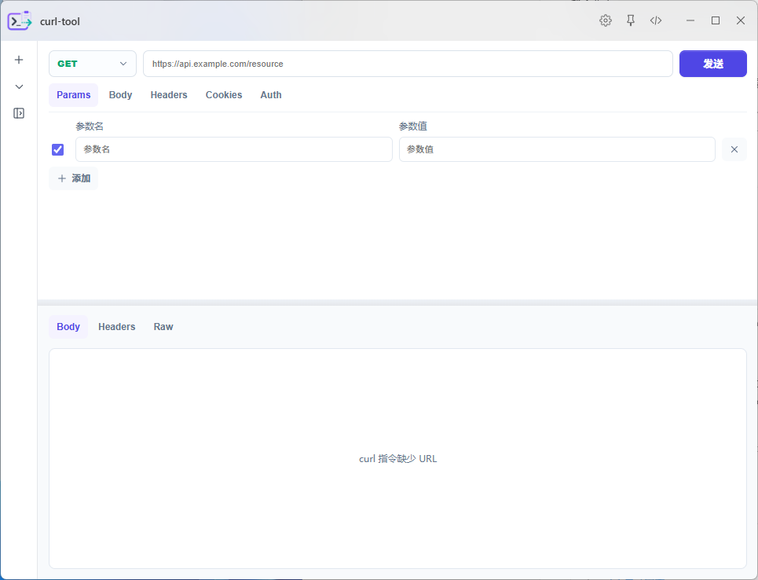
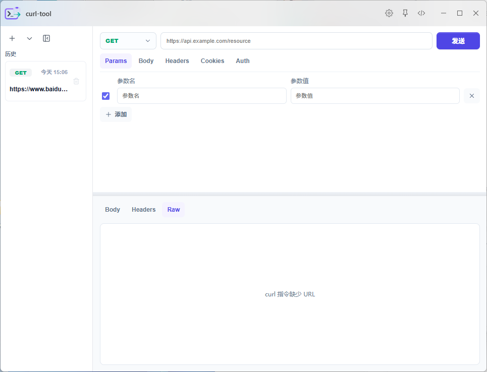
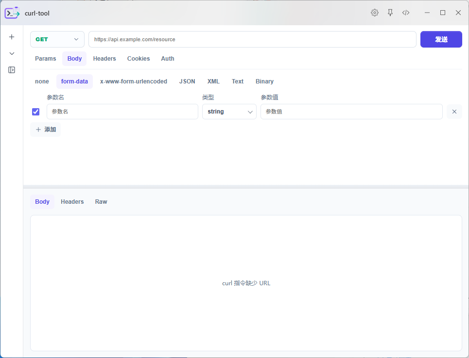
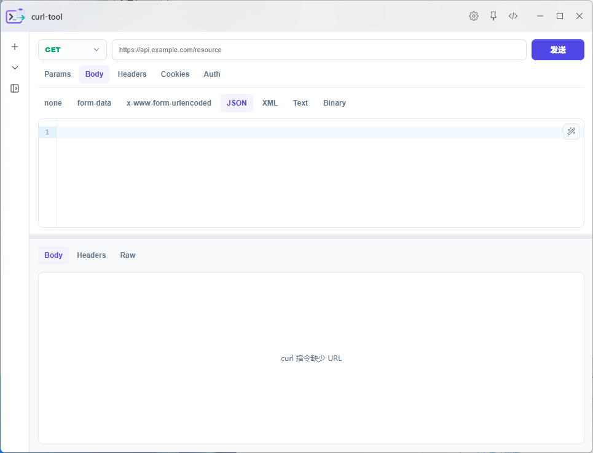
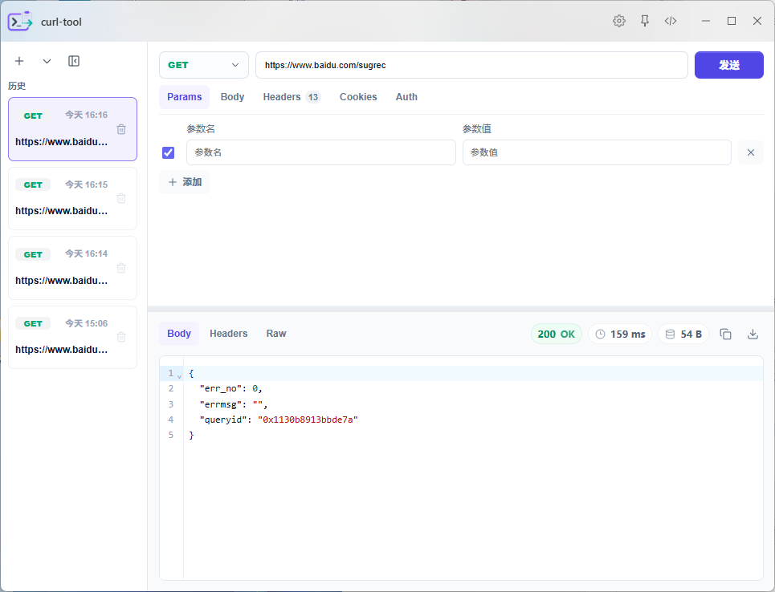
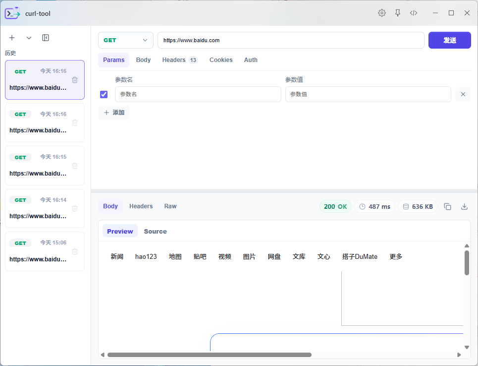
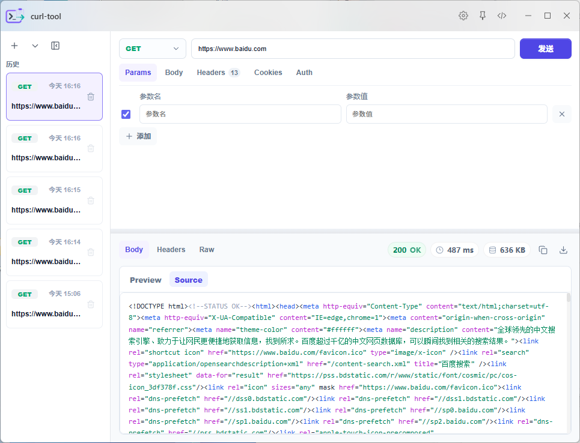

# Curl Tool

Curl Tool 是一个面向 ZTools 的接口调试插件，用于从剪贴板或输入内容中读取 curl 指令，解析为可编辑的 HTTP 请求，并在插件内完成发送、响应查看和结果下载。

## 功能说明

- 支持从 ZTools 剪贴板入口自动识别并导入 `curl ...` 指令。
- 支持手动新建请求，编辑请求方法、URL、Params、Headers、Cookies、Auth 和 Body。
- Body 支持 `none`、`form-data`、`x-www-form-urlencoded`、`JSON`、`XML`、`Text`、`Binary`。
- `form-data` 支持文本和文件字段，`Binary` 支持单文件上传。
- 请求通过 ZTools preload 本地通道发送，避免浏览器 CORS 限制。
- 支持请求历史记录、历史删除、历史面板收起和按请求时间排序。
- 响应支持 JSON、XML、HTML、文本、图片和二进制文件展示。
- JSON/XML 响应支持格式化、层级折叠、搜索定位和一键复制。
- 二进制响应支持文件类型识别、响应头信息展示、大小展示和下载。

## 插件信息

- 插件名称：`curl-tool`
- 插件标题：`Curl Tool`
- 插件分类：`development`、`network`
- 主入口：`index.html`
- preload 入口：`preload/services.js`
- 触发命令：`curl-tool`、`curl`、`HTTP 请求`、`接口调试`、`请求调试`
- 自动识别：匹配以 `curl` 或 `curl.exe` 开头的文本内容

## 界面预览















## 开发

```bash
npm install
npm run dev
```

开发服务默认运行在：

```text
http://localhost:5173
```

`public/plugin.json` 中的 `development.main` 已指向该地址，ZTools 开发模式会加载本地服务。

## 构建

```bash
npm run build
```

构建产物输出到 `dist/`。在 `ZTools-plugins` 仓库中，仓库级构建脚本会检测变更插件，安装依赖、执行构建，并将 `dist/` 打包为插件 zip。

## 目录结构

```text
curl-tool/
├── images/                 # README 使用的界面截图
├── public/
│   ├── logo.png            # 插件图标
│   ├── plugin.json         # ZTools 插件配置
│   └── preload/
│       ├── package.json
│       └── services.js     # 本地请求、文件写入等 Node 能力
├── src/
│   ├── components/         # 请求编辑、历史、响应等组件
│   ├── components/renderers/
│   ├── pages/
│   ├── utils/
│   ├── App.vue
│   ├── main.css
│   └── main.ts
├── index.html
├── package.json
├── tsconfig.json
└── vite.config.js
```

## 验证清单

提交或打包前建议验证：

```bash
npm run build
```

手动验证：

- 复制一段 `curl ...` 指令，通过 ZTools 剪贴板入口打开插件，确认能自动解析。
- 发送 JSON 请求，确认响应可以 pretty 展示、搜索和复制。
- 发送 `form-data` 请求，确认文本字段和文件字段正常。
- 请求图片或二进制资源，确认响应预览、文件信息和下载正常。
- 多次发送请求，确认历史记录按真实请求时间排序，点击历史不会改变排序。
