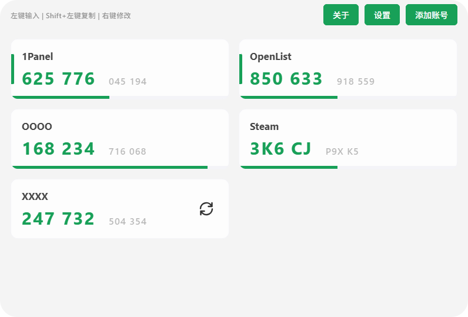
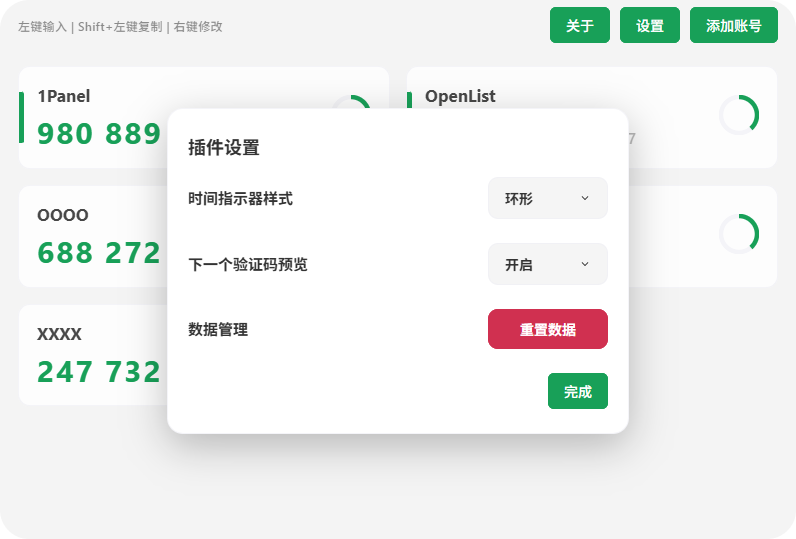

# 2FA 动态验证码

一个功能强大的 ZTools 剪贴板历史管理插件，支持文本、图像、文件的历史记录查看、搜索、收藏等功能。

## 截图





## 核心特性

### 1. 安全存储

- **密钥保护**：采用加密逻辑保护本地存储数据。
- **硬件绑定**：支持设备指纹实现开启即自动解锁。
- **隐私验证**：查看密钥原文需经过身份验证。

### 2. 全协议支持

- **多种协议**：支持 TOTP、HOTP 以及 Steam 令牌。
- **灵活配置**：支持多种哈希算法及自定义验证码位数。

### 3. 先进交互

- **实时预览**：支持在主界面同步预览下一周期的验证码。
- **智能填充**：根据协议自动匹配算法规范。
- **视觉切换**：支持环形与条形两种指示器模式。

### 4. 便捷管理

- **灵活排序**：支持账号一键置顶及拖拽排序。
- **极速复制**：支持点击快捷复制并提供动态反馈。
- **数据重置**：支持一键清空所有数据。

## 使用说明

### 基本操作
- **快速填入**：点击账号卡片，自动复制并模拟输入对应验证码
- **仅复制验证码**：Shift + 左键点击卡片，仅复制不自动输入
- **拖动排序**：长按卡片即可自由拖动调整账号顺序
- **置顶账号**：右键卡片可置顶当前账号（置顶账号不支持拖动）
- **进度条样式**：可在设置中切换「条形 / 环形」展示
- **下一码预览**：可在设置中开启，提前显示下一轮验证码

## 项目结构

```text
.
├── public/
│   ├── logo.png              # 插件图标
│   ├── plugin.json           # 插件配置文件
│   ├── README.md             # 插件市场展示说明
│   └── preload/              # Preload 脚本目录
├── src/
│   ├── components/           # UI 组件库
│   │   ├── Modals/           # 模态框组件
│   │   └── AccountCard.vue   # 账号条目核心组件
│   ├── composables/          # 逻辑层
│   │   ├── useAccounts.ts    # 账户增删改查与解密
│   │   ├── useAuth.ts        # 身份验证及密钥派生
│   │   └── useTicker.ts      # 高精度计时器与令牌更新
│   ├── utils/                # 工具函数
│   │   ├── crypto.ts         # 加密与安全存储集成
│   │   └── otp.ts            # OTP 核心算法实现
│   ├── App.vue               # 插件主入口
│   ├── constants.ts          # 全局常量定义
│   ├── main.css              # 全局样式系统
│   └── main.ts               # 项目启动引导
├── vite.config.js            # Vite 构建配置
└── tsconfig.json             # TypeScript 类型配置
```

## 快速开发

### 安装依赖

```bash
npm install
```

### 开发模式

```bash
npm run dev
```

### 构建打包

```bash
npm run build
```

## 更新日志

### v1.1.0

- **鲁棒性修复**：修复了 Base32 非法字符导致的计算漏洞及重置状态清理不彻底问题。
- **代码清理**：移除了项目目录下冗余的演示模板文件夹，显著精简项目体积。
- **类型优化**：消除了 `crypto.subtle` 调用中的冗余类型断言，提升代码规范性。

### v1.0.4

- **文档规范化**：精简了插件元数据描述，并规范化了 README 说明文档。

### v1.0.3

- **功能补全**：修复了查看密钥的身份验证逻辑漏洞，解决了弹窗层级叠加遮挡问题。

### v1.0.2

- **视觉还原**：基于原始备份 `dist/App.vue` 实现了 100% 的 UI 文本与样式还原。

### v1.0.1

- **架构重构**：完成从单体架构向 Composables + Components 模块化架构的全面迁移。

---

**基于 ZTools 插件框架开发**

## 开源协议

本项目基于 **MIT License** 协议开源。

> **重要声明**：本项目仅供个人学习和研究使用。